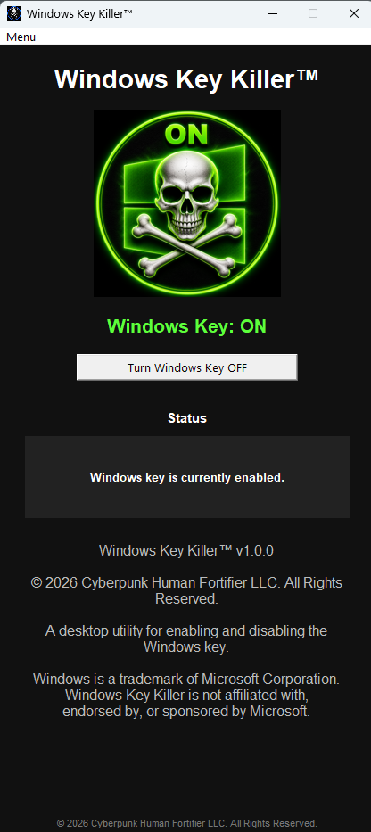
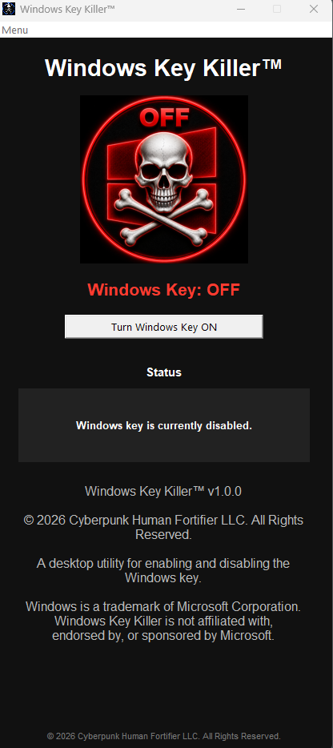
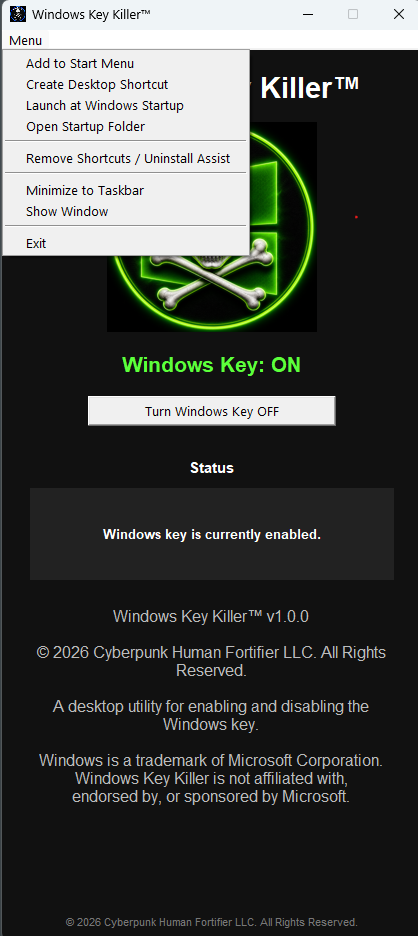
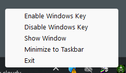

# Windows Key Killer™

A lightweight desktop utility for enabling and disabling the Windows key.

Windows Key Killer™ is designed for gaming, productivity workflows, kiosk systems, and anyone who accidentally presses the Windows key while working or playing.

## Features

* Enable or disable the Windows key
* Visual ON/OFF indicators
* System tray integration
* Desktop shortcut creation
* Start Menu shortcut creation
* Windows Startup integration
* Cleanup / uninstall assistance
* Standalone executable
* No Python installation required

## Screenshots

### Windows Key Enabled

### Windows Key Disabled

### Menu

### System Tray

## System Requirements

* Windows 10
* Windows 11

## Privacy

Windows Key Killer™ does not collect, transmit, store, or share user data.

## Disclaimer

Windows is a trademark of Microsoft Corporation.

Windows Key Killer™ is not affiliated with, endorsed by, or sponsored by Microsoft.

## Copyright

© 2026 Cyberpunk Human Fortifier LLC

All Rights Reserved.
